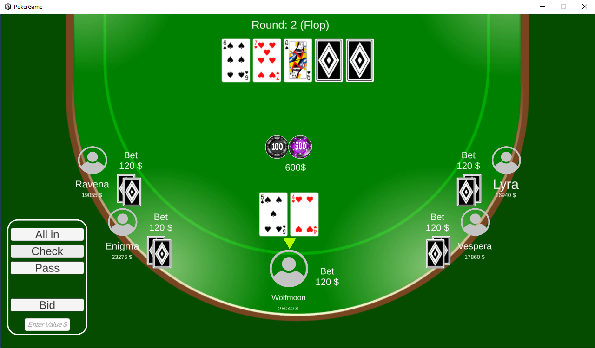

# Poker 2D

## Description

Poker 2D is an implementation of Texas Holdem poker game in Unity. It is multiplayer, can host multiple game rooms at once and has persistent database (stored on AWS) for player's accounts. You can play it in your local network on a few computers with friends (or enemies at that moment :P) by running the game server on one host machine, and providing the host IP adress on the client machines in the GUI client application.

This is an example how the game looks like:

## Future works

The team plans some improvements:
- adding bot players - artificial players that will play with real people
- improving graphics (especially menu UI)
- making game more stable and secure (data and connection security)